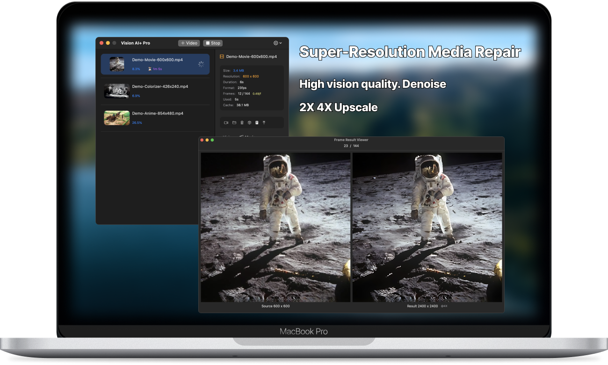

# README.md
- [Deutsch](README.de.md)
- [English](README.md)
- [Spanish](README.es.md)
- [French](README.fr.md)
- [언어](README.ko.md)
- [日本語](README.ja.md)
- [简体中文](README.zh_cn.md)
- [繁体中文](README.zh_tw.md)

# Vision AI+ Verbessert die Qualität von Anime. Video 2K Reparatur. Graustufen-Video-Farbverstärker

Laden Sie [die neueste Version aus dem macOS App Store herunter](https://apps.apple.com/de/app/id6445976076)

V2.3
---
- Unterstützung für die Konvertierung von .mov Dateien hinzugefügt
- Option zum Ausgabeformat .mp4 oder .mov Dateityp hinzugefügt
- Fehler behoben: Kann keine Frames aus alten .mov Dateien extrahieren
- [V2.3](https://download.marksdo.com/apps/VisionAI/V2.3/VisionAI.dmg)

V2.2
---
- Fehler in der Projektliste behoben
- Absturzprobleme behoben
- [V2.2](https://download.marksdo.com/apps/VisionAI/V2.2/VisionAI.dmg)

V2.1
---
- Funktion zum Zurücksetzen von Aufgaben auf ihren ursprünglichen Zustand hinzugefügt
- Funktion zum Duplizieren von Projekten zur Vergleich der Ergebnisse verschiedener Modelle hinzugefügt
- Wenn mehrere Projekte ausgewählt sind, wird das Projekt-Panell direkt das Menü für die Stapelverarbeitung anzeigen
- Doppelklicken Sie auf die Projektliste, um die Ergebnisdatei abzuspielen
- Festes Seitenverhältnis von Videocovern behoben
- Absturzproblem bei der Zusammenführung von Videos mit langer Dauer behoben
- Problem behoben, dass einige Videolängen nicht abgerufen werden können
- [V2.1](https://download.marksdo.com/apps/VisionAI/V2.1/VisionAI.zip)

V2.0
---
- Anpassung an macOS 14 Sonoma
- Hinzugefügt: Schnelles Videotrimmwerkzeug, mit dem Benutzer schnell einen bestimmten Ausschnitt eines Videos für die visuelle Verbesserungsverarbeitung extrahieren können
- Neugestaltung der Symbolleiste in der Hauptoberfläche
- Hinzugefügt: Möglichkeit zum Herunterladen von Cloud-Modellen, um die Größe des Installationspakets zu reduzieren
- Die App kann Konvertierungsaufgaben fortsetzen, während der Bildschirm gesperrt ist
- Die Projektliste unterstützt die Mehrfachauswahl mit Tastenkombinationen wie ⌘+a und Del
- Abgeschlossene Aufgaben können mit einem Klick mit der Funktion zur Modellverbesserung erneut in Verbesserungsprojekte umgewandelt werden
- Unterstützt zusätzliche Sprachen
- Fehlerbehebungen und Leistungsverbesserungen

V1.4.2
---
- Einige Thread-Verklemmungsprobleme behoben
- Hinzufügen des Links zur Fehlerberichterstattung mit Discord. Falls Sie auf ein Problem stoßen, benötigen wir das Ursprungsvideo zur Behebung. Verwenden Sie Discord, um uns zu kontaktieren.

V1.4
---
- Entfernen des Hintergrunds kann nur den Hintergrund verwischen, hervorgehobenes Porträt
- Hinzufügung eines neuen Anime-Stils (insgesamt 3 Anime-Stil-Konvertierungsmodelle)

V1.3
---
- Hinzufügen von KI-Modellen für das Entfernen des Hintergrunds und den Austausch des Hintergrunds
- Hinzufügen eines Anime-Stil-Konvertierungsmodells
- Hinzufügen eines Kontextmenüs für Aufgaben
- Dateien per Drag & Drop erstellen Konvertierungsaufgabe

V1.0~1.2
---
- Verbesserung von Videos mit KI-Super-Resolution. Erhalten Sie hohe Bildqualität
- Anime auf AI 2X 4X Skalieren. Erhalten Sie hohe Bildqualität
- Konvertieren Sie ein Graustufen-Video in ein farbiges Video mit KI-Colorizer
- Konvertieren Sie ein Video in ein Skizzenstil-Video
- Unterstützung für Stapel-Konvertierungsaufgaben
- Unterstützung für Unterbrechung von Aufgaben und späteres Fortsetzen
- Unterstützung zum Ändern der Konvertierungsreihenfolge von Stapelaufgaben
- Benutzerdatenschutz wird gewährleistet, alle Dateiverarbeitungen erfolgen lokal
- Unterstützung für verschiedene Sprachen

## Funktionen

### Konvertieren Sie Anime-Videos in hoher Qualität

### Färben Sie Graustufenfilme

### Konvertieren Sie Filme in hoher Qualität, 2K Reparatur

### Konvertieren Sie Videos in Skizzenstil-Videos für Spaß
