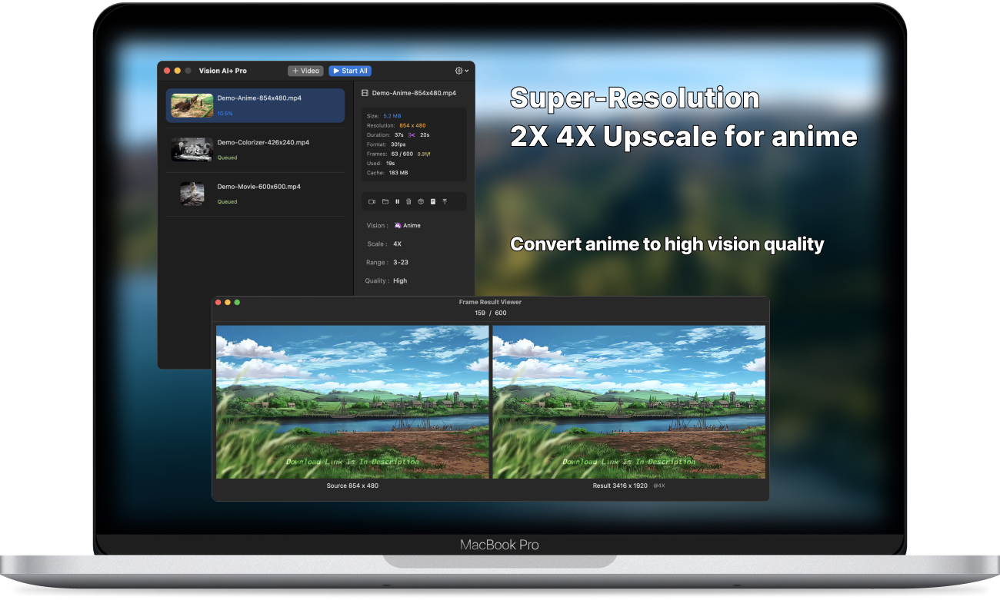
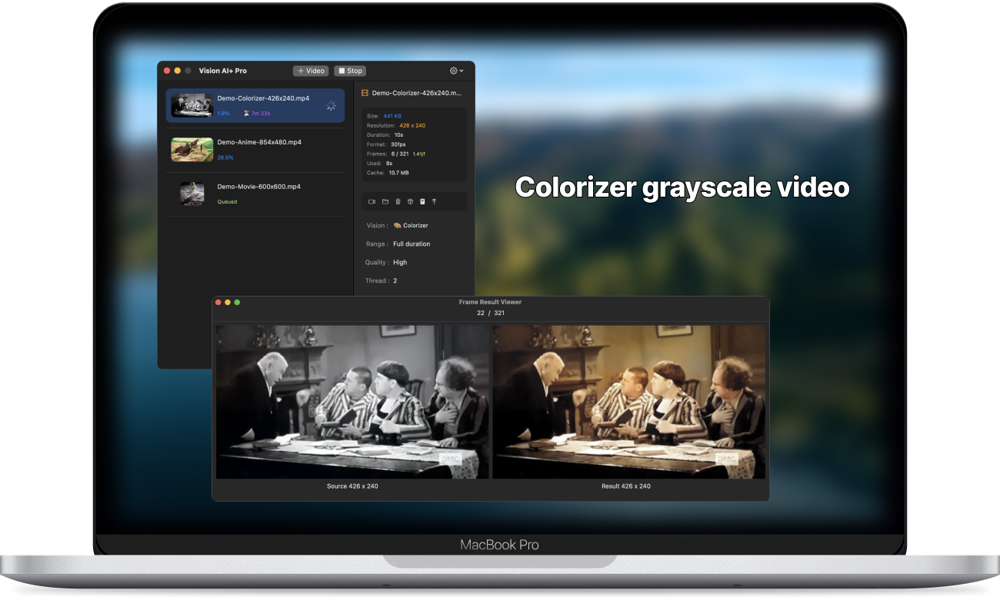
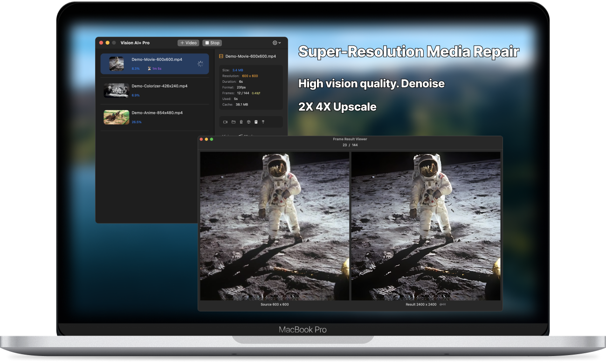
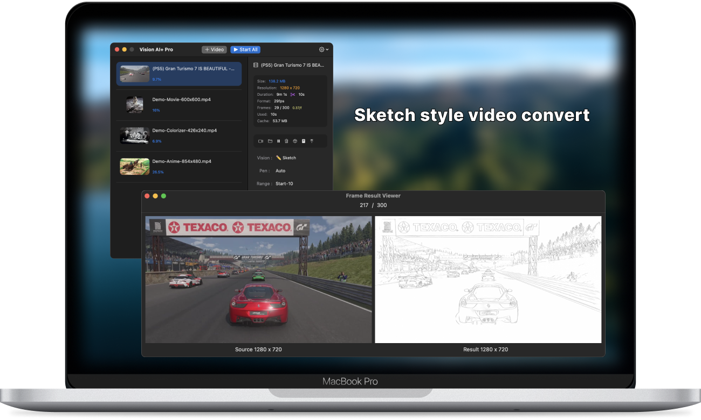

# README.md
- [Deutsch](README.de.md)
- [English](README.md)
- [Spanish](README.es.md)
- [French](README.fr.md)
- [언어](README.ko.md)
- [日本語](README.ja.md)
- [简体中文](README.zh_cn.md)
- [繁体中文](README.zh_tw.md)

# Vision AI+ Mejora la calidad del anime. Reparación de video 2K. Colorizador de video en escala de grises.

Descarga [la última versión de la App Store de macOS](https://apps.apple.com/us/app/id6445976076)

V2.3
---
- Se añadió soporte para la conversión de archivos .mov
- Se añadió la opción de formato de archivo de salida .mp4 o tipo de archivo .mov
- Se solucionó el problema de no poder extraer fotogramas en archivos .mov antiguos
- [V2.3](https://download.marksdo.com/apps/VisionAI/V2.3/VisionAI.dmg)

V2.2
---
- Se solucionaron problemas de interfaz de usuario en la lista de proyectos
- Se solucionaron problemas de bloqueo
- [V2.2](https://download.marksdo.com/apps/VisionAI/V2.2/VisionAI.dmg)

V2.1
---
- Se añadió la función de restablecer tareas a su estado inicial.
- Se añadió la función de duplicar proyectos para comparar los resultados de diferentes modelos.
- Cuando se seleccionan varios proyectos, el panel de proyectos mostrará directamente el menú de operaciones por lotes.
- Doble clic en la lista de proyectos para reproducir el archivo de resultado.
- Se corrigió la proporción de aspecto fija de las portadas de video.
- Se solucionó un problema de bloqueo al fusionar videos de larga duración.
- Se solucionó el problema de no poder recuperar la duración de algunos videos.
- [V2.1](https://download.marksdo.com/apps/VisionAI/V2.1/VisionAI.zip)

V2.0
---
- Adaptado a macOS 14 Sonoma
- Se añadió una herramienta rápida de recorte de video, que permite a los usuarios extraer rápidamente un fragmento específico de un video para su procesamiento de mejora visual.
- Rediseñada la barra de herramientas de la interfaz principal.
- Se añadió la función de descarga de modelos en la nube para reducir el tamaño del paquete de instalación.
- La aplicación puede continuar las tareas de conversión mientras la pantalla está bloqueada.
- La lista de proyectos admite la selección múltiple con teclas de acceso directo como ⌘+a y Del.
- Las tareas completadas se pueden convertir directamente en proyectos de mejora nuevamente con un solo clic utilizando la función de mejora del modelo.
- Admite idiomas adicionales.
- Correcciones de errores y mejoras de rendimiento.

V1.4.2
---
- Se solucionó el problema de bloqueo de algunos hilos.
- Se añadió un nuevo enlace para informar problemas a través de Discord. Si encuentras algún problema, necesitamos el video original para solucionarlo. Utiliza Discord para ponerse en contacto con nosotros.

V1.4
---
- La función de eliminar el fondo solo puede desenfocar el fondo, destacando el retrato.
- Se añadió un nuevo estilo de anime (3 modelos de conversión de estilo de anime en total).

V1.3
---
- Se añadió el modelo de IA para el proceso de eliminación y reemplazo de fondo.
- Se añadió el modelo de conversión de estilo de anime.
- Se añadió menú contextual en la tarea.
- Se añadió soporte para arrastrar archivos para crear tareas de conversión.

V1.0~1.2
---
- Mejora de video con IA de super resolución. Obten una calidad de visión alta.
- Mejora del anime mediante ampliación AI 2X 4X. Obten una calidad de visión alta.
- Convierte video en escala de grises a video colorizado por IA.
- Convierte video a video de estilo de boceto.
- Soporte de tareas de conversión por lotes.
- Soporte para pausar tareas y reiniciar más tarde.
- Soporte para cambiar el orden de conversión de tareas por lotes.
- Mantiene la privacidad del usuario, todo el procesamiento de los archivos se realiza en la máquina local.
- Soporte multilingüe.

## Características

### Convierte videos de anime a alta calidad

### Coloriza películas en escala de grises

### Convierte películas a alta calidad, reparación 2K

### Convierte videos a videos en estilo de boceto por diversión
