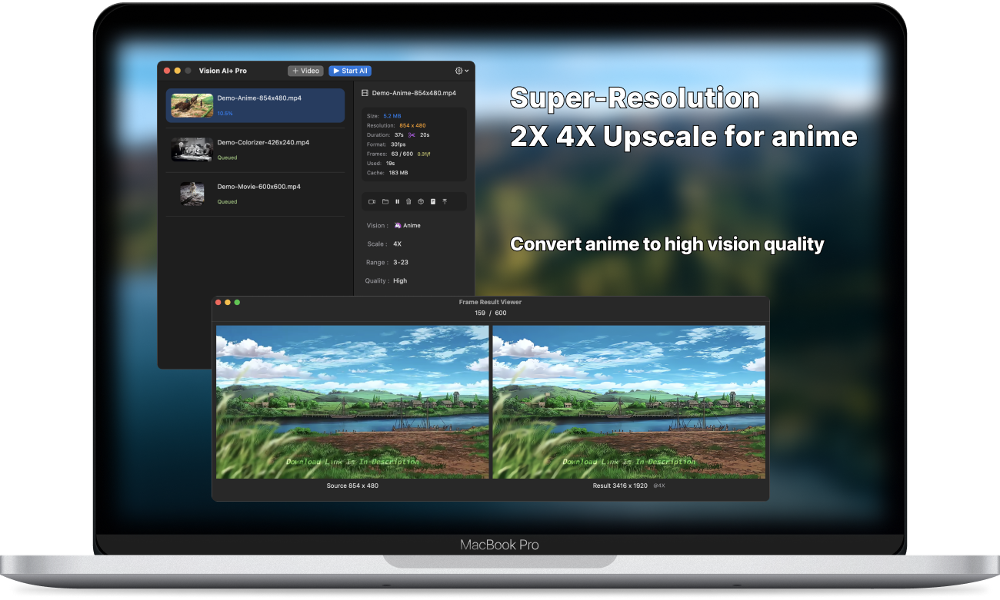
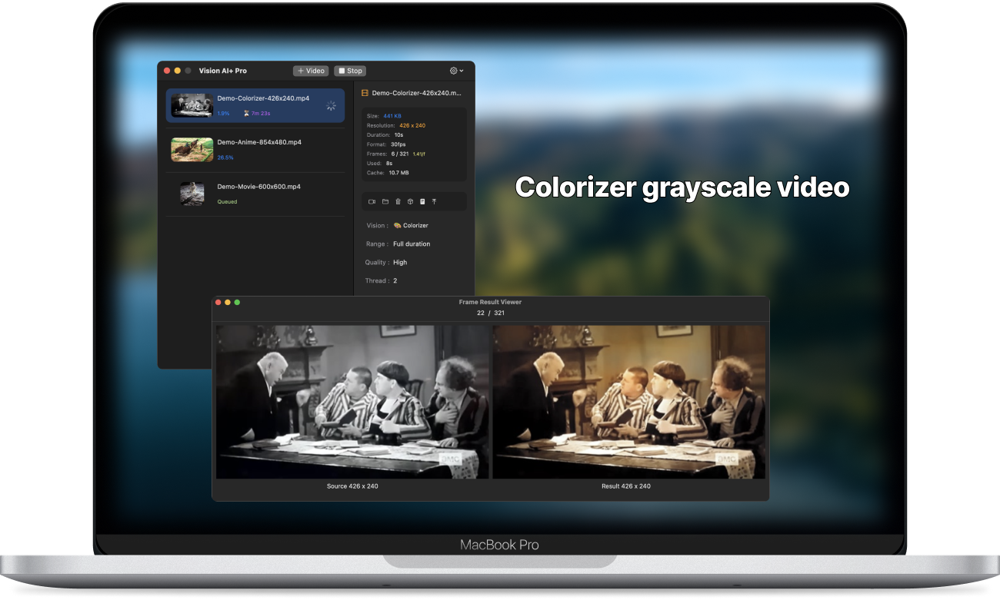

# Vision AI+ Miglioramento della qualità dell'anime. Riparazione video 2K. Colorizzatore video in scala di grigi

Scarica [la versione più recente dall'appstore di macOS](https://apps.apple.com/us/app/id6445976076)

V2.3
---
- Aggiunto supporto per convertire file .mov
- Aggiunta opzione per il formato di output del file .mp4 o .mov
- Risolti problemi nell'estrazione dei fotogrammi nei vecchi file mov
- [V2.3](https://download.marksdo.com/apps/VisionAI/V2.3/VisionAI.dmg)

V2.2
---
- Risolti problemi di UI nella lista dei progetti
- Risolti problemi di crash
- [V2.2](https://download.marksdo.com/apps/VisionAI/V2.2/VisionAI.dmg)

V2.1
---
- Aggiunta funzionalità per ripristinare i compiti al loro stato iniziale
- Aggiunta funzionalità per duplicare i progetti per confrontare i risultati ottenuti da modelli diversi
- Quando vengono selezionati più progetti, il pannello del progetto mostra direttamente il menu delle operazioni in blocco
- Fare doppio clic sulla lista dei progetti per riprodurre il file dei risultati
- Risolto il problema del rapporto di aspetto fisso delle copertine dei video
- Risolto un problema di crash durante la fusione di video di lunga durata
- Risolto il problema di impossibilità di ottenere la durata di alcuni video
- [V2.1](https://download.marksdo.com/apps/VisionAI/V2.1/VisionAI.zip)

V2.0
---
- Adattato a macOS 14 Sonoma
- Aggiunto uno strumento di ritaglio video rapido che consente agli utenti di estrarre rapidamente un frammento specifico di un video per il trattamento di miglioramento visivo
- Ridisegnata la barra degli strumenti nell'interfaccia principale
- Aggiunta la funzionalità di download del modello cloud per ridurre le dimensioni del pacchetto di installazione
- L'app può continuare le conversioni anche quando lo schermo è bloccato
- La lista dei progetti supporta la selezione multipla con tasti di scelta rapida come ⌘+a e Del
- I compiti completati possono essere convertiti direttamente nuovamente in progetti di miglioramento con un solo clic utilizzando la funzione di miglioramento del modello
- Supporta ulteriori lingue
- Risoluzione di bug e miglioramenti delle prestazioni

V1.4.2
---
- Risolto alcuni problemi di blocco del thread
- Aggiunto nuovo link per segnalare i problemi su Discord. Se incontri un problema, abbiamo bisogno del video originale per risolverlo. Usa Discord per contattarci.

V1.4
---
- Rimuovi Background può solo sfocare lo sfondo, ritraendo in evidenza
- Aggiunto nuovo stile anime (totale 3 modelli di conversione anime)

V1.3
---
- Aggiunto modello di intelligenza artificiale per rimuovere e sostituire lo sfondo
- Aggiunto modello di conversione di stile anime
- Aggiunto menu contestuale sulla lista dei compiti
- Aggiunto supporto per il rilascio di file per creare compiti di conversione

V1.0~1.2
---
- Miglioramento video con l'intelligenza artificiale Super-Resolution. Ottieni una visione di alta qualità
- Miglioramento di anime con l'intelligenza artificiale 2X 4X Upscale. Ottieni una visione di alta qualità
- Converti video in scala di grigi in video colorizzati con l'intelligenza artificiale
- Converti video in video in stile schizzo
- Supporto per compiti di conversione batch
- Supporto per interrompere i compiti e riprenderli in seguito
- Supporto per cambiare l'ordine di conversione dei compiti in batch
- Mantieni la privacy degli utenti, tutte le operazioni sui file vengono effettuate in locale
- Supporto multilingue

## Caratteristiche

### Converti video anime in alta qualità

### Colorizzatore di film in scala di grigi

### Converti film in alta qualità, ripara in 2K

### Converti video in video in stile schizzo per divertimento
