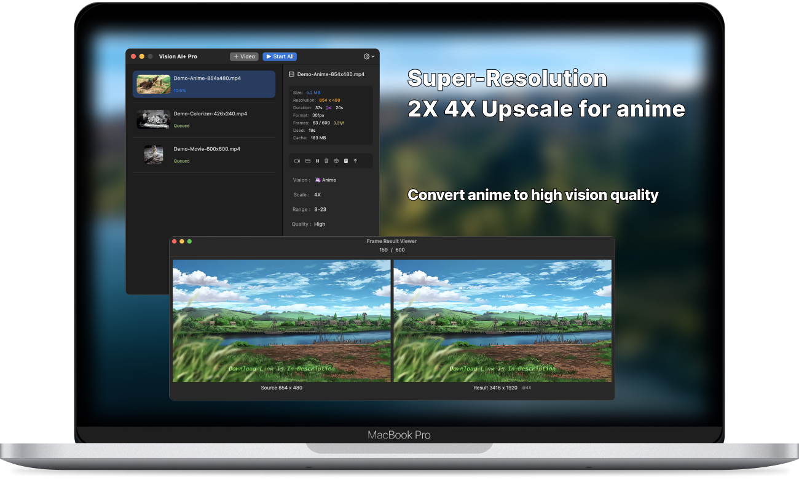
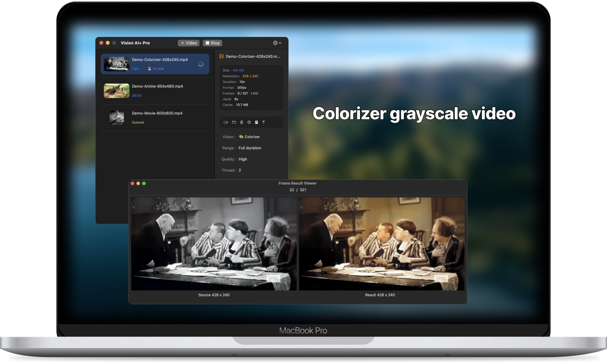
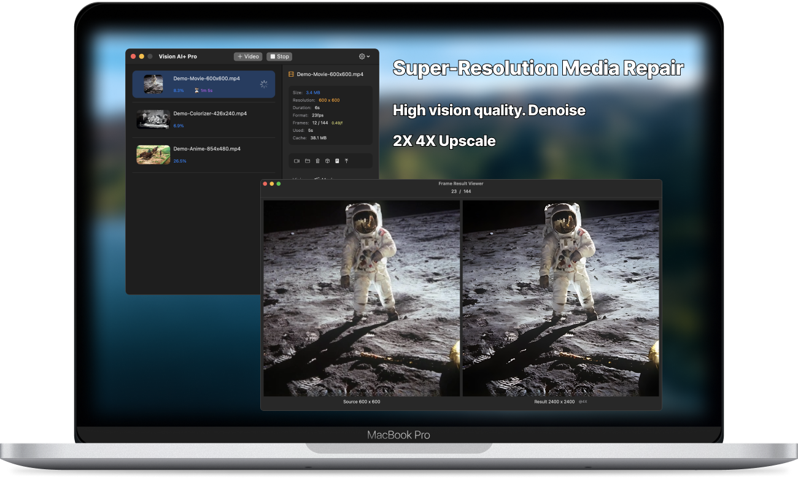
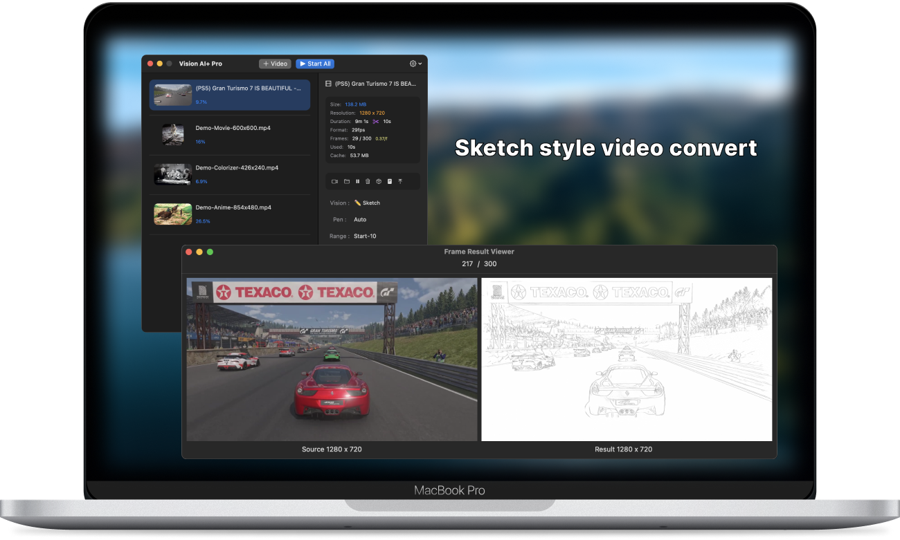

# README.md
- [Deutsch](README.de.md)
- [English](README.md)
- [Spanish](README.es.md)
- [French](README.fr.md)
- [Italian](README.it.md)
- [언어](README.ko.md)
- [日本語](README.ja.md)
- [简体中文](README.zh_cn.md)
- [繁体中文](README.zh_tw.md)

# Vision AI+ 提升動漫品質。影片2K修復。灰階影片上色器

從macOS應用商店[下載最新版本](https://apps.apple.com/us/app/id6445976076)

V2.3
---
- 增加對.mov文件的支持
- 增加輸出文件格式.mp4或.mov文件類型選項
- 修復無法提取舊.mov文件中的幀數問題
- [V2.3](https://download.marksdo.com/apps/VisionAI/V2.3/VisionAI.dmg)

V2.2
---
- 修復項目列表中的UI問題
- 修復崩潰問題
- [V2.2](https://download.marksdo.com/apps/VisionAI/V2.2/VisionAI.dmg)

V2.1
---
- 添加重置任務到初始狀態的功能
- 添加重複項目以比較不同模型的結果的功能
- 當選擇多個項目時，項目面板將直接顯示批量操作菜單
- 雙擊項目列表以播放結果文件
- 修復視頻封面固定的比例問題
- 修復合併長時段視頻時的崩潰問題
- 修復無法檢索某些視頻的長度問題
- [V2.1](https://download.marksdo.com/apps/VisionAI/V2.1/VisionAI.zip)

V2.0
---
- 適應macOS 14 Sonoma
- 添加快速視頻修剪工具，允許用戶快速提取視頻的特定片段進行視覺增強處理
- 在主界面重新設計了工具欄
- 添加了雲端模型下載功能，以減小安裝包的大小
- 應用可以在屏幕鎖定時繼續轉換任務
- 項目列表支持使用快捷鍵（如⌘+a和Del）進行多選
- 可以使用模型增強功能將已完成的任務直接轉換為增強項目
- 支持其他語言
- 修復錯誤和提升性能

V1.4.2
---
- 修復一些線程堵塞問題
- 添加了與discord的新問題回報鏈接。如果遇到問題，我們需要原始視頻以進行修復。使用discord與我們聯繫。

V1.4
---
- 移除背景只能模糊背景的功能，突出人物
- 添加了新的動漫風格（總共3種動漫風格轉換模型）

V1.3
---
- 添加去除背景和替換背景處理AI模型
- 添加動漫風格轉換模型
- 在任務上添加上下文菜單
- 添加支持拖放文件以創建轉換任務

V1.0~1.2
---
- 使用AI超分辨率增強視頻。獲得高視覺品質
- 使用AI 2X 4X倍增動漫品質。獲得高視覺品質
- 將灰階影片轉換為上色影片
- 將視頻轉換為素描風格影片
- 支持批量轉換任務
- 支持中斷任務並稍後重新啟動
- 支持更改批量任務轉換順序
- 保護用戶隱私，所有文件處理在本地機器上進行
- 多語言支持

## 功能

### 將動漫視頻轉換為高品質視頻

### 上色灰階電影

### 將電影轉換為高品質，2K修復

### 將視頻轉換為素描風格影片，用於娛樂
